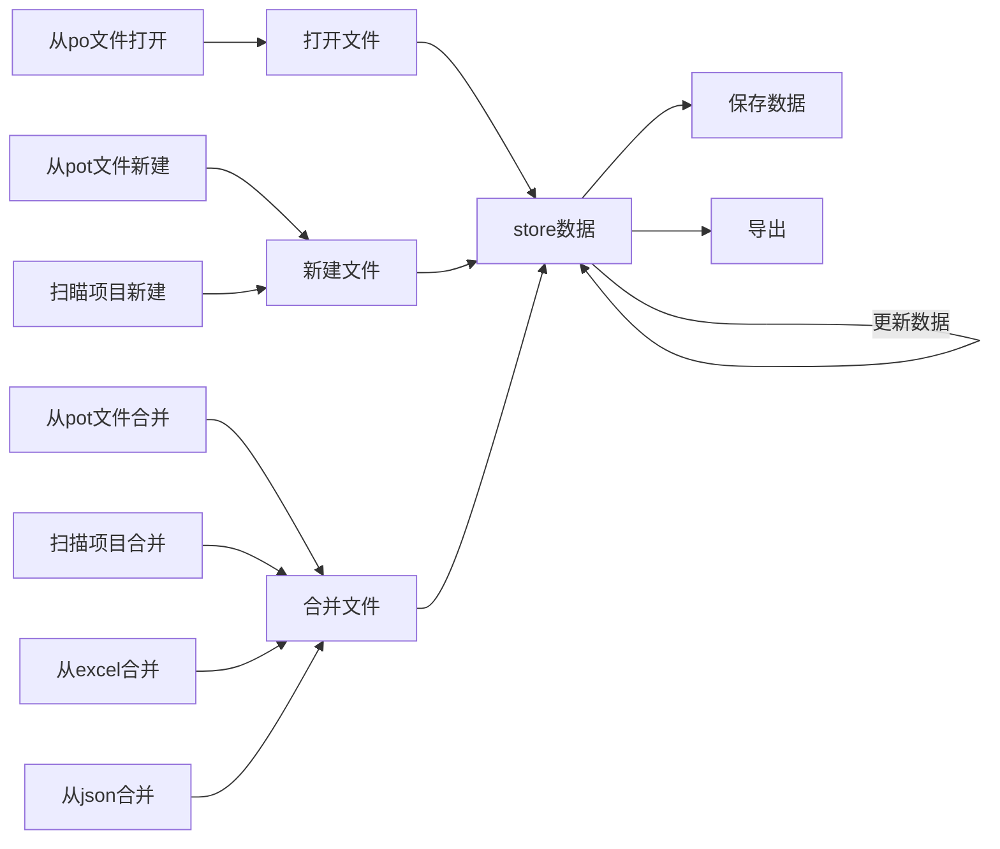

<script src="https://unpkg.com/browse/mermaid@7.1.1/dist/mermaid.min.js"></script>
# 开发时启动步骤

1. 启动 gettext-content 的 webpack-server 服务
2. 启动 electron 编译 watch
3. 启动 electron

合并已有的翻译文件，可以导入 excel 模板，暂定模板如下
| subject        | translation | remark |
| -------------- | ----------- | ------ |
| translate this | 翻译一下    |        |

# 流程图


```mermaid
  
```
# 主要功能列表

- [ ] 打开 PO 文件->读取内容->导入 store->并渲染列表
  - [ ] 从菜单打开 PO 文件
  - [ ] 从页面打开 PO 文件
- [ ] 从 store 中编译数据，保存文件
- [ ] 扫描项目文件夹（需要填写 PO 文件头）
  - [ ] 从菜单进入扫描
  - [ ] 从页面进入扫描
