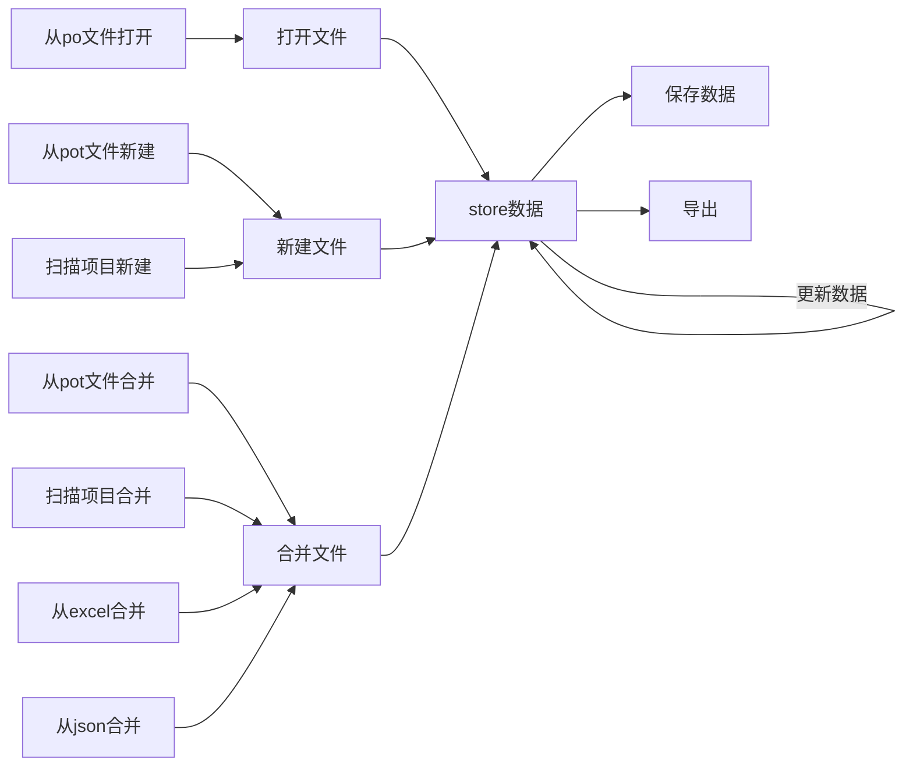

# 开发时启动步骤

1. 启动 gettext-content 的 webpack-server 服务
2. 启动 electron 编译 watch
3. 启动 electron

合并已有的翻译文件，可以导入 excel 模板，暂定模板如下
**注: domain 暂时会忽略**
| domain | context | singular_key | singular_str | plural_key | plural_str | comments |
| ------ | ------- | ------------ | ------------ | ---------- | ---------- | -------- |
| domain | context | {0}个苹果    | {0} apple    | {0}个苹果  | {0} apples |          |

# 流程图



```mermaid

```

# 主要功能列表

1. [x] 扫描 `jed` 的链式调用方法(由于没有现成的库可用,这里是用babel转换) 形如:
   1. [x] 考虑其它链式调用方法名,这里也要支持自定义方法名
   2. [x] 支持 `js`,`ts`,`jsx`,`tsx` 类型文件
   3. [x] babel转换ast的注释结构不能直接定位到对应方法,需要另想它法
2. [ ] 更新翻译
   1. [ ] 从po/pot文件更新翻译
   2. [ ] 扫描项目更新项目
3. [x] 导出已翻译/未翻译条目为 excel

```javascript
i18n
  .translate("new project %d")
  .withContext("context")
  .ifPlural(1, "default %d keys")
  .fetch(1);
```
1. [ ] 扫描 `gettext` 方法 形如
   1. [ ] 这是需要支持自定义方法名称
```javascript
gettext = function ( key )
dgettext = function ( domain, key )
dcgettext = function ( domain, key, category )
ngettext = function ( singular_key, plural_key, value )
dngettext = function ( domain, singular_ley, plural_key, value )
dcngettext = function ( domain, singular_key, plural_key, value, category )
pgettext = function ( context, key )
dpgettext = function ( domain, context, key )
npgettext = function ( context, singular_key, plural_key, value )
dnpgettext = function ( domain, context, singular_key, plural_key, value )
dcnpgettext = function ( domain, context, singular_key, plural_key, value, category )
```