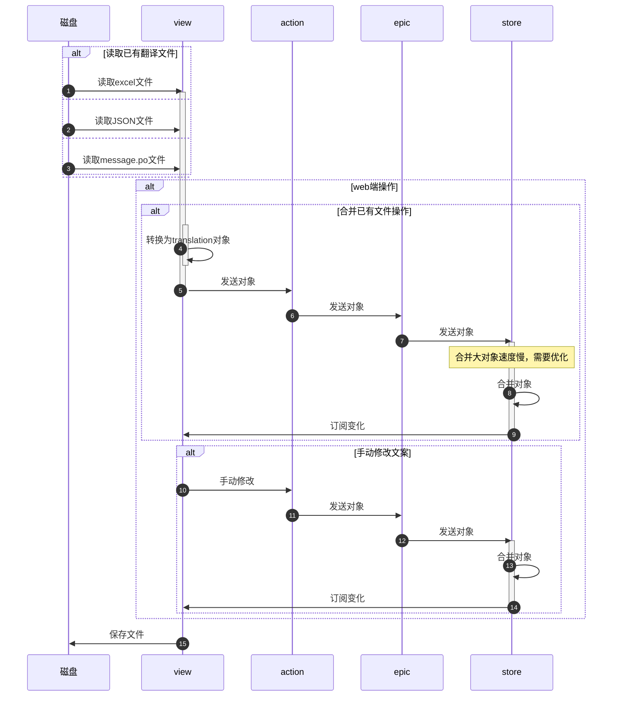

# 新建项目流程
```mermaid
sequenceDiagram
    autonumber
    participant sys as 磁盘
    participant box as electron壳
    participant web as web端
    alt 新建项目流程
        alt 扫描项目
            sys->>+box: 扫描文件夹，获取信息
        else
            sys->>+box: 读取PO文件
        end
        box->>box: 生成translation对象
        box->>+web: 发送转换后的对象
        web->>web: 修改文案/合并翻译
        web->>-box: 保存
        box->>-sys: 保存成PO文件
    end
```
# 更新翻译流程（修改文案/合并翻译）



# 提取翻译
##  通过脚本提取
    支持形如以下方式的方法
```js
const gettext = function ( key ){/**/};
const dgettext = function ( domain, key ){/**/};
const dcgettext = function ( domain, key, category ){/**/};
const ngettext = function ( singular_key, plural_key, value ){/**/};
const dngettext = function ( domain, singular_ley, plural_key, value ){/**/};
const dcngettext = function ( domain, singular_key, plural_key, value, category ){/**/};
const pgettext = function ( context, key ){/**/};
const dpgettext = function ( domain, context, key ){/**/};
const npgettext = function ( context, singular_key, plural_key, value ){/**/};
const dnpgettext = function ( domain, context, singular_key, plural_key, value ){/**/};
const dcnpgettext = function ( domain, context, singular_key, plural_key, value, category ){/**/};
```

## 通过gettext工具提取
支持链式调用 (后续会合并支持上面的单个方法调用)
```js
i18n.translate("%d key").withContext("context").ifPlural( n, "default %d keys" ).fetch( n );
```
# 编译成POT文件
# 合并PO文件
    1. 通过gettext工具提取
# 翻译所有文案
# 替换PO文件
# 解析PO文件
这里使用 [JED](http://messageformat.github.io/Jed/) 库来做为i18n的库